# wcbot — World Cup Telegram Prediction Bot

**wcbot** (internally called **bolt**) is a Telegram-native World Cup prediction game. Users join group chats managed by the bot, register themselves, and then privately submit scoreline predictions and player wagers before each matchday. Points are calculated from 90-minute results and player statistics fetched from the API-Football v3 API. Group leaderboards are published automatically at the end of every matchday.

The system is architected as a single Python monolith running inside one Docker container against one PostgreSQL database. All scheduling is handled in-process via APScheduler; there is no external cache, message queue, or worker fleet.

---

## Table of Contents

1. [High-Level Architecture](#1-high-level-architecture)
2. [Module & Folder Structure](#2-module--folder-structure)
3. [Configuration Layer (`config/`)](#3-configuration-layer-config)
4. [Database Layer (`database/`)](#4-database-layer-database)
5. [Service Layer (`services/`)](#5-service-layer-services)
   - 5.1 [matches_service](#51-matches_service)
   - 5.2 [predictions_service](#52-predictions_service)
   - 5.3 [leaderboard_service](#53-leaderboard_service)
   - 5.4 [scoring_engine](#54-scoring_engine)
   - 5.5 [sports_api](#55-sports_api)
   - 5.6 [cron_scheduler](#56-cron_scheduler)
6. [Bot Layer (`bot/`)](#6-bot-layer-bot)
   - 6.1 [Handlers](#61-handlers)
   - 6.2 [FSM States](#62-fsm-states)
7. [Scheduled Jobs (CRON)](#7-scheduled-jobs-cron)
8. [Points & Scoring System](#8-points--scoring-system)
9. [Prediction Locking Rules](#9-prediction-locking-rules)
10. [User & Group Flows](#10-user--group-flows)
11. [Data Flow — End-to-End](#11-data-flow--end-to-end)
12. [Scripts](#12-scripts)
13. [Deployment](#13-deployment)
14. [Error Handling](#14-error-handling)
15. [Key Design Constraints](#15-key-design-constraints)

---

## 1. High-Level Architecture

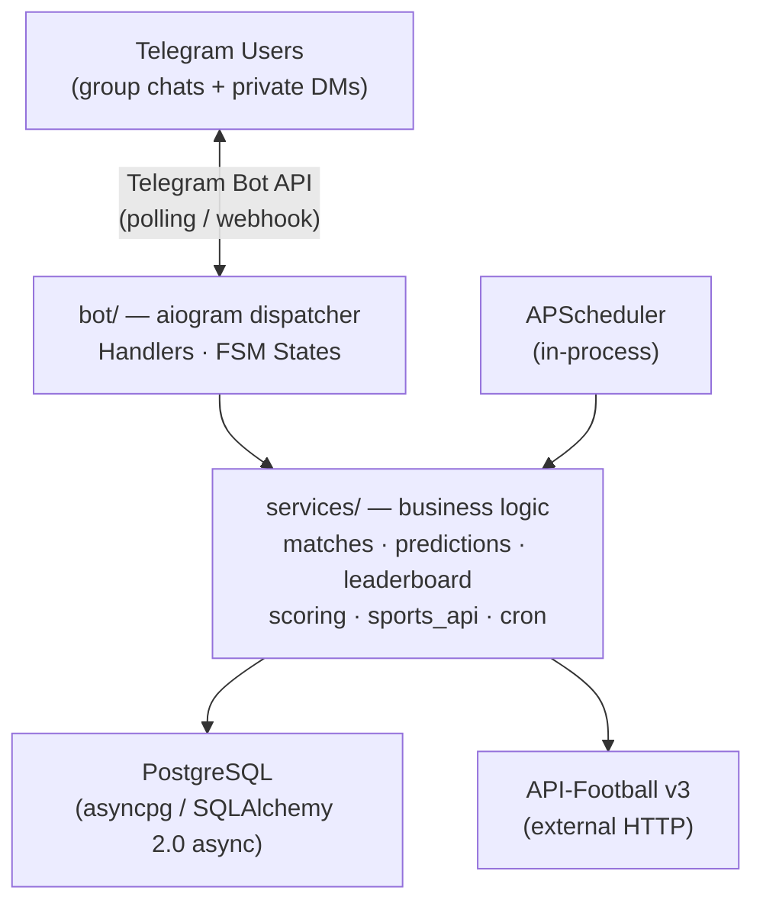

**Strict layering rules (enforced by project convention):**

| Layer | Allowed to… | Not allowed to… |
|---|---|---|
| `bot/handlers` | Validate input, call services, format responses | Query DB, calculate points, call HTTP APIs |
| `services/` | Own all business logic, DB access, API calls | Nothing prohibited |
| `config/` | Load env vars, expose DB session factory | Own business logic |
| `database/models.py` | Declare ORM models | Contain queries or logic |

---

## 2. Module & Folder Structure

```
wcbot/
├── .env                        # Secrets (never committed)
├── Dockerfile
├── requirements.txt
│
├── config/
│   ├── db.py                   # AsyncEngine + session_scope() context manager
│   └── settings.py             # Pydantic-settings: Settings (BOT_TOKEN, DATABASE_URL, …)
│
├── database/
│   ├── schema.sql              # Canonical DDL — source of truth for table structure
│   ├── models.py               # SQLAlchemy 2.0 ORM models (mirrors schema.sql exactly)
│   └── migrations/             # Future structural changes
│
├── bot/
│   ├── main.py                 # Entry point: builds Dispatcher, mounts routers, starts polling
│   ├── handlers/
│   │   ├── group.py            # /register /leaderboard /daily /individual
│   │   ├── private.py          # /matchday /status /timeline /groups /breakdown /feedback
│   │   └── system.py           # Bot-join events, welcome messages, global error handler
│   └── states/
│       ├── prediction.py       # PredictionFlow FSM (choosing_match → entering_score → adding_wagers)
│       └── feedback.py         # FeedbackFlow FSM (awaiting_text)
│
├── services/
│   ├── matches_service.py      # Fixture sync, day-slate queries, match locking, matchday IDs
│   ├── predictions_service.py  # Upsert predictions/wagers, player search, status reads
│   ├── leaderboard_service.py  # Registration, leaderboard queries, snapshot writes
│   ├── scoring_engine.py       # Score prediction + wager math, odds multipliers
│   ├── sports_api.py           # API-Football v3 HTTP client (fixtures, odds, player stats)
│   └── cron_scheduler.py       # APScheduler job definitions (Daily Blast, etc.)
│
└── scripts/
    └── backfill_player_ids.py  # One-time offline script: resolves world_cup_players.player_id
```

---

## 3. Configuration Layer (`config/`)

### `config/settings.py` — `Settings`

A Pydantic `BaseSettings` class. All values are loaded from environment variables (or a local `.env` file). No secret has a hardcoded default.

| Setting | Purpose | Default |
|---|---|---|
| `BOT_TOKEN` | Telegram bot token | — (required) |
| `DATABASE_URL` | SQLAlchemy async URL (`postgresql+asyncpg://…`) | — (required) |
| `API_FOOTBALL_KEY` | API-Football v3 API key | — (required) |
| `API_FOOTBALL_HOST` | API-Football base URL | `https://v3.football.api-sports.io` |
| `LEAGUE_ID` | API-Football league id for the World Cup | `1` |
| `SEASON` | Tournament season year | `2026` |
| `TZ` | Canonical timezone for all time calculations | `Asia/Singapore` |
| `LOG_LEVEL` | Python logging level | `INFO` |

`settings.tzinfo` is a computed property returning `ZoneInfo(self.TZ)`, used everywhere time-zone-aware comparisons are needed.

### `config/db.py` — `session_scope()`

Creates the async SQLAlchemy engine and `SessionLocal` factory. Exposes `session_scope()` — an async context manager that:
1. Opens an `AsyncSession`
2. Commits on clean exit
3. Rolls back on any exception
4. Always closes the session

All service functions that write data use `session_scope()` for transactional safety.

---

## 4. Database Layer (`database/`)

### Schema Overview

`database/schema.sql` is the authoritative DDL. `database/models.py` maps to it using SQLAlchemy 2.0 declarative ORM — the two must remain in sync.

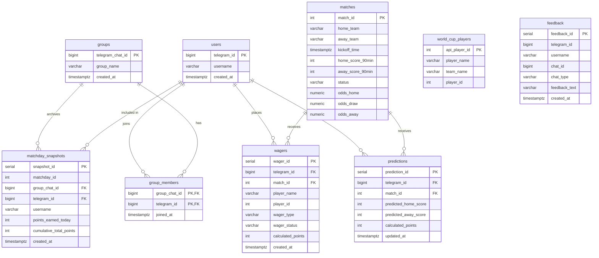

### Model Constants (defined in `database/models.py`)

```python
# Match status
MATCH_SCHEDULED   = "SCHEDULED"
MATCH_IN_PROGRESS = "IN_PROGRESS"
MATCH_FINISHED    = "FINISHED"

# Wager types
WAGER_SCORE  = "SCORE"
WAGER_ASSIST = "ASSIST"
WAGER_CARD   = "CARD"

# Wager outcomes
WAGER_PENDING = "PENDING"
WAGER_HIT     = "HIT"
WAGER_MISSED  = "MISSED"
WAGER_VOID    = "VOID"
```

### Performance Indexes

| Index | Column(s) | Purpose |
|---|---|---|
| `idx_matches_kickoff` | `matches.kickoff_time` | Day-slate range scans |
| `idx_predictions_lookup` | `predictions(telegram_id, match_id)` | Per-user prediction reads |
| `idx_wagers_lookup` | `wagers(telegram_id, match_id)` | Per-user wager reads |
| `idx_snapshots_lookup` | `matchday_snapshots(group_chat_id, matchday_id DESC)` | Latest snapshot queries |

---

## 5. Service Layer (`services/`)

All business logic lives here. Services are plain async functions; none of them send Telegram messages directly — that responsibility belongs to handlers.

### 5.1 `matches_service`

**Responsibilities:** fixture synchronisation from API-Football, day-slate queries, match-locking logic, and `matchday_id` encoding.

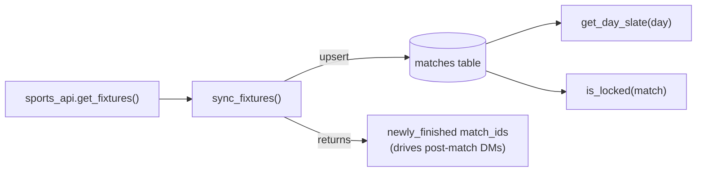

| Function | Description |
|---|---|
| `sync_fixtures()` | Fetches the full World Cup fixture list from API-Football and upserts every row into `matches`. Returns the list of `match_id`s that transitioned to `FINISHED` on this call — used by the post-match cron to fire DMs exactly once. **Idempotent.** |
| `get_day_slate(session, day)` | Returns all `Match` rows with `kickoff_time` within the SGT calendar day, ordered by kickoff. |
| `is_locked(match, *, at=None)` | Returns `True` when the current SGT time is within `LOCK_LEAD_MINUTES` (60) of kickoff. |
| `matchday_id_for(kickoff)` | Encodes a kickoff `datetime` as the integer `YYYYMMDD` in SGT — the key used in `matchday_snapshots`. |
| `matchday_id_to_date(matchday_id)` | Decodes `YYYYMMDD` back to a `date` object. |

### 5.2 `predictions_service`

**Responsibilities:** create/update predictions and wagers, player search, and aggregated status reads for the daily prompts.

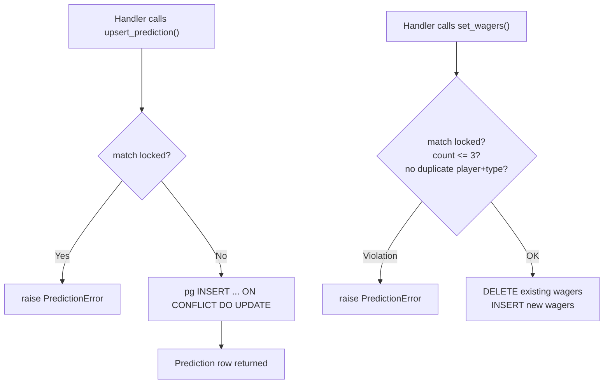

| Function | Description |
|---|---|
| `upsert_prediction(session, telegram_id, match_id, home, away)` | Creates or updates the user's scoreline prediction. Rejects if locked or if scores are negative. Relies on `UNIQUE(telegram_id, match_id)`. |
| `set_wagers(session, telegram_id, match_id, wagers)` | Atomically replaces all wagers for a user+match pair. Enforces ≤ 3 wagers, valid types (`SCORE`/`ASSIST`/`CARD`), no duplicate `(player, type)` pairs, and lock status. |
| `search_players(session, query, match_id, limit)` | Accent-insensitive in-Python search of `world_cup_players`. When `match_id` is given, restricts to the two teams playing that match. Uses `TEAM_ALIASES` to bridge the spelling gap between fixture team names and player-pool team names. |
| `get_user_day_entries(session, telegram_id, day)` | Returns `DayEntry` objects for the day's slate — each wrapping a `Match`, the user's `Prediction`, their `Wager` list, and the computed `locked` flag. Powers `/status`. |
| `get_match_participants(session, match_id)` | Returns every user with a prediction or wager on a match, with their data. Used to fan-out post-match DMs. |
| `find_missing_prediction_users(session, day)` | Finds registered users who have not predicted every match in the day's slate. Powers the Slacker Warning cron. |
| `get_all_member_ids(session)` | Distinct `telegram_id`s of all registered group members. Used by the Daily Blast cron to drive the DM loop. |

#### `DayEntry` dataclass

```python
@dataclass(frozen=True)
class DayEntry:
    match: Match
    prediction: Prediction | None
    wagers: list[Wager]
    locked: bool
```

#### Player Name Normalisation

`search_players` uses `_fold()` — NFKD decomposition + combining-character removal + lowercasing — so `"alvarez"` matches `"Álvarez"` and `"Hlozek"` matches `"Hložek"` without requiring a PostgreSQL `unaccent` extension.

### 5.3 `leaderboard_service`

**Responsibilities:** user/group registration, leaderboard calculation, per-user group ranking, matchday snapshot persistence.

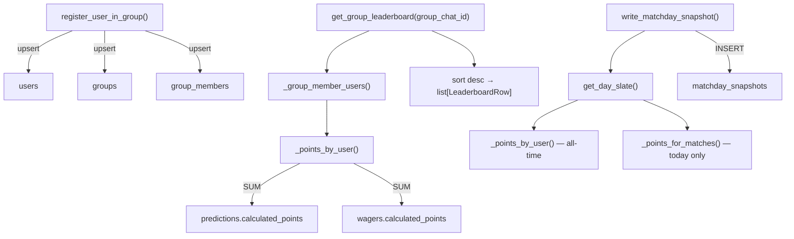

| Function | Description |
|---|---|
| `register_user_in_group()` | Upserts `users`, `groups`, and `group_members` rows. Returns `True` if the membership is new. **Idempotent.** |
| `ensure_group()` | Upserts only the `groups` row (used when the bot is added to a chat). |
| `get_group_leaderboard(session, group_chat_id)` | Current standings for a group: sums `predictions.calculated_points + wagers.calculated_points` across all members, sorted descending. Returns `list[LeaderboardRow]`. |
| `get_user_groups_with_rank(session, telegram_id)` | For `/groups`: every group the user belongs to, with their rank, total points, and the top two members of each group. Returns `list[GroupRank]`. |
| `get_matchday_breakdown(session, group_chat_id, matchday_id)` | Per-match, per-user point breakdown for one matchday (powers `/individual`). Returns blocks `{"match": Match, "rows": [...]}`. |
| `write_matchday_snapshot(session, group_chat_id, day)` | Persists a static leaderboard snapshot for one (group, matchday). Stores both today's points and the cumulative total. Clears prior rows first for idempotency. |
| `get_latest_snapshot(session, group_chat_id)` | Returns the most recent `(matchday_id, [MatchdaySnapshot])` pair for a group — used by `/daily`. |
| `reveal_already_posted(session, group_chat_id, matchday_id)` | Guard check: returns `True` if a snapshot already exists, preventing the Daily Reveal from running twice. |

#### Key dataclasses

```python
@dataclass(frozen=True)
class LeaderboardRow:
    telegram_id: int
    username: str
    points: int     # predictions + wagers combined

@dataclass(frozen=True)
class GroupRank:
    group_chat_id: int
    group_name: str
    rank: int
    members: int
    points: int
    top_username: str | None
    top_points: int
    second_username: str | None
    second_points: int
```

### 5.4 `scoring_engine`

**Responsibilities:** all points arithmetic for predictions and wagers. Pure functions where possible; the top-level `score_match()` is async because it calls the sports API.

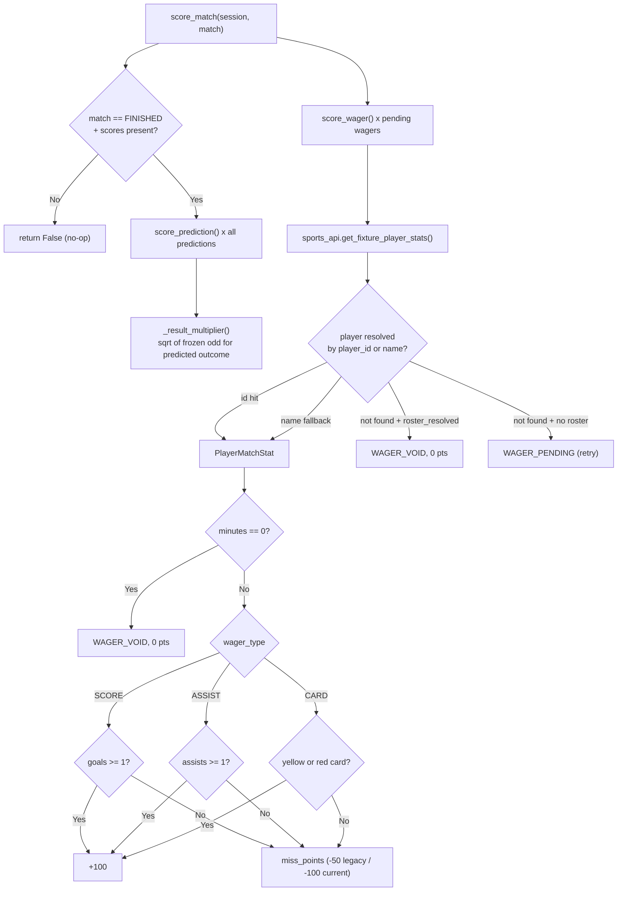

| Function | Signature | Description |
|---|---|---|
| `score_match` | `(session, match) → bool` | Scores all predictions and pending wagers for a finished match. Idempotent — overwrites existing `calculated_points`. |
| `score_prediction` | `(pred_home, pred_away, act_home, act_away, multiplier) → int` | Pure function. Returns 0 if wrong result. Returns `(50 + [150 if exact]) × multiplier` rounded to int. |
| `score_wager` | `(wager_type, stat, miss_points, roster_resolved) → (status, points)` | Pure function. Determines `HIT/MISSED/VOID/PENDING` and the associated points. |
| `_result_multiplier` | `(match, pred_home, pred_away) → float` | Returns `sqrt(odd)` for the predicted outcome using frozen match odds. Defaults to `1.0` if odds are unavailable or match pre-dates odds scoring. |
| `_miss_points_for` | `(match) → int` | Returns the wager miss penalty for this match (legacy −50 or current −100, split by `WAGER_MISS_RULE_CHANGE_DATE`). |

### 5.5 `sports_api`

**Responsibilities:** all outbound HTTP calls to API-Football v3. Returns plain dataclasses; never touches the database.

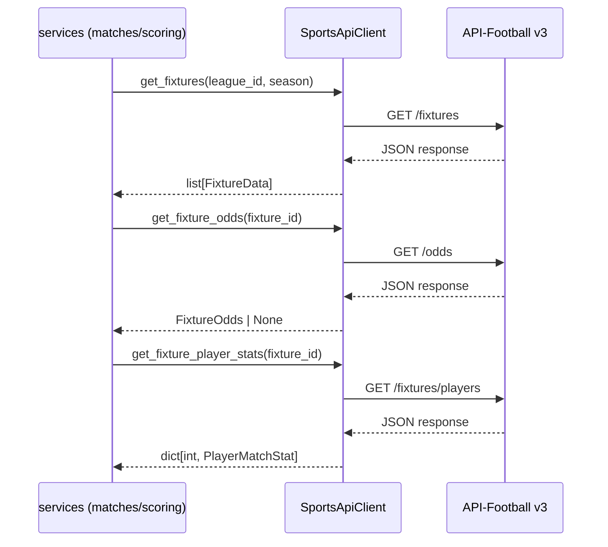

| Dataclass | Fields |
|---|---|
| `FixtureData` | `match_id, home_team, away_team, kickoff_time, status, home_score_90min, away_score_90min` |
| `FixtureOdds` | `home: float, draw: float, away: float` (decimal "Match Winner" odds) |
| `PlayerMatchStat` | `api_player_id, player_name, minutes, goals, assists, yellow_cards, red_cards` |

API-Football fixture status codes are mapped to internal constants:

| API codes | Internal status |
|---|---|
| `FT, AET, PEN` | `MATCH_FINISHED` |
| `1H, HT, 2H, ET, BT, P, LIVE, INT, SUSP` | `MATCH_IN_PROGRESS` |
| Everything else (`NS, TBD, PST, CANC, …`) | `MATCH_SCHEDULED` |

A module-level `sports_api = SportsApiClient()` singleton is used by other services for convenience.

### 5.6 `cron_scheduler`

**Responsibilities:** registers all five scheduled jobs with APScheduler and provides the job functions themselves. All jobs run inside the application process.

See [Section 7](#7-scheduled-jobs-cron) for full job descriptions.

---

## 6. Bot Layer (`bot/`)

### 6.1 Handlers

Handlers contain **no business logic**. They:
1. Validate that the command is used in the correct chat type (group vs. private)
2. Extract arguments from the Telegram update
3. Call one or more service functions
4. Format the result as a Telegram message

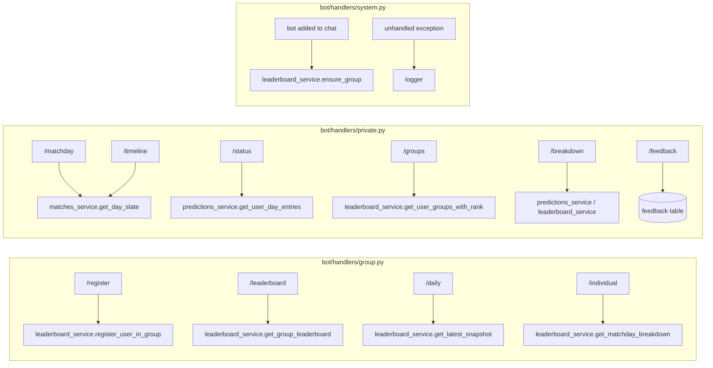

#### Group commands

| Command | Handler file | Description |
|---|---|---|
| `/register` | `group.py` | Registers the calling user in the current group chat. |
| `/leaderboard` | `group.py` | Displays current standings for the group. |
| `/daily` | `group.py` | Shows the leaderboard snapshot for the most recently published matchday. |
| `/individual` | `group.py` | Per-match, per-user point breakdown for the most recently published matchday. |

#### Private commands

| Command | Handler file | Description |
|---|---|---|
| `/matchday` | `private.py` | Lists today's matches with kickoff times in SGT. |
| `/status` | `private.py` | Displays the user's predictions + wagers for today, with edit option if not locked. |
| `/timeline` | `private.py` | Countdown to kickoff for each match today. |
| `/groups` | `private.py` | Lists all groups the user is in, with their rank in each. |
| `/breakdown` | `private.py` | Points earned per game for elapsed matches, plus upcoming match status. |
| `/feedback` | `private.py` | Submit feedback (FSM-driven in DM; inline `/feedback <text>` in groups). |

### 6.2 FSM States

The prediction and wager submission flow uses aiogram's FSM (Finite State Machine) to guide users through a multi-step conversation in their private DM with the bot.

#### `PredictionFlow` (`bot/states/prediction.py`)

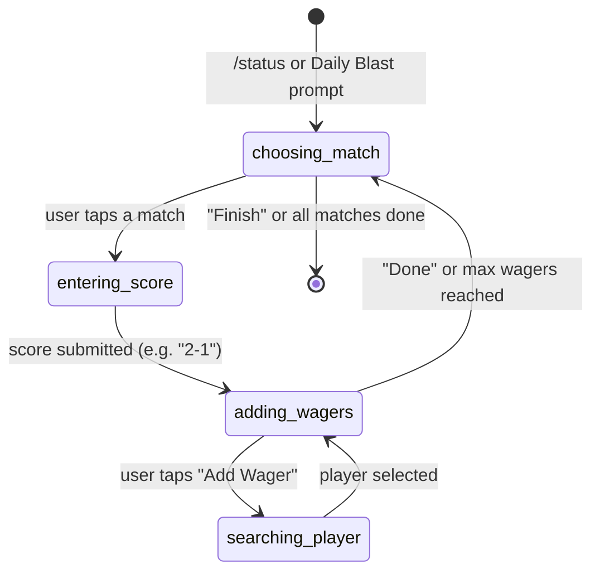

| State | What the user sees |
|---|---|
| `choosing_match` | Inline keyboard listing today's matches |
| `entering_score` | Prompt: "Enter your predicted score for Home vs Away (e.g. 2-1)" |
| `adding_wagers` | Inline keyboard: current wagers + "Add Wager" / "Done" |
| `searching_player` | Text prompt: "Type a player name to search" → live results |

FSM context data carried between states:

| Key | Type | Purpose |
|---|---|---|
| `day` | `str` (ISO date) | The matchday being predicted |
| `match_id` | `int` | Match currently being entered |
| `wager_drafts` | `list[dict]` | Accumulated `{player_name, wager_type}` for the current match |

#### `FeedbackFlow` (`bot/states/feedback.py`)

| State | Description |
|---|---|
| `awaiting_text` | Bot has prompted the user; the next free-text message is saved as feedback |

> **Note:** This flow is only used in private DMs. In group chats, feedback is submitted inline as `/feedback <text>` because Telegram privacy mode hides plain-text follow-ups.

---

## 7. Scheduled Jobs (CRON)

All five jobs are registered with APScheduler and run inside the single application process. **Every job must be idempotent** — running it twice must produce the same result.

```mermaid
gantt
    title Typical Matchday Timeline (SGT)
    dateFormat HH:mm
    axisFormat %H:%M

    section CRON jobs
    Daily Blast (T-8h)          :milestone, m1, 08:00, 0m
    Slacker Warning (T-2h)      :milestone, m2, 14:00, 0m
    Lineup Lockdown (T-1h each) :milestone, m3, 15:00, 0m
    Match Kickoff               :milestone, m4, 16:00, 0m
    Post-Match Analysis         :milestone, m5, 17:45, 0m
    Daily Reveal                :milestone, m6, 18:00, 0m
```

| Job | Trigger | Description |
|---|---|---|
| **Daily Blast** | 8 hours before first kickoff | Loops all registered users; sends a private DM with today's match slate and prompts for predictions + wagers. |
| **Slacker Warning** | 2 hours before first kickoff | Queries `find_missing_prediction_users()`; sends a reminder DM to users who haven't predicted all games yet. |
| **Lineup Lockdown** | 1 hour before each individual match | The `is_locked()` function enforces a time-based lock 60 minutes before each match — no separate DB status column is needed. |
| **Post-Match Analysis** | After each match finishes | Calls `sync_fixtures()` to detect newly finished matches → `score_match()` → sends a per-user breakdown DM to all participants. |
| **Daily Reveal** | After all matches on the day finish | Calls `write_matchday_snapshot()` for each group → publishes the updated leaderboard to each group chat. Guards against double-posting with `reveal_already_posted()`. |

---

## 8. Points & Scoring System

### Prediction Points

| Outcome | Points |
|---|---|
| Correct result (right winner / draw) | +50 |
| Exact scoreline (correct result already awarded) | +150 additional (200 total) |
| Wrong result | 0 |

**Odds multiplier (from a configurable date onwards):** When frozen "Match Winner" odds are available, the awarded prediction points are multiplied by `sqrt(odd)` for the predicted outcome. This rewards picking upsets. If odds are unavailable, scoring is flat (`multiplier = 1.0`).

### Wager Points

| Outcome | Points |
|---|---|
| Wager hit (player scored / assisted / was carded) | +100 |
| Wager missed | −100 (legacy: −50 for early matches) |
| Player void (0 minutes played, or not in squad) | 0 |

**Constraints:** Maximum 3 wagers per match. Wager types: `SCORE`, `ASSIST`, `CARD`.

### Player Resolution Priority

The scoring engine resolves wagers to player statistics in this order:

1. **By `player_id`** — canonical API-Football id copied from `world_cup_players.player_id` at wager time (exact, immune to name drift).
2. **By normalised full name** — NFKD-normalised name match against `PlayerMatchStat.player_name`.
3. **By first-initial + surname** — fallback for abbreviated API names.
4. **Unresolved + full roster available** → `WAGER_VOID` (player wasn't in the squad).
5. **Unresolved + no roster** → `WAGER_PENDING` (fetch failed; retry next tick).

---

## 9. Prediction Locking Rules

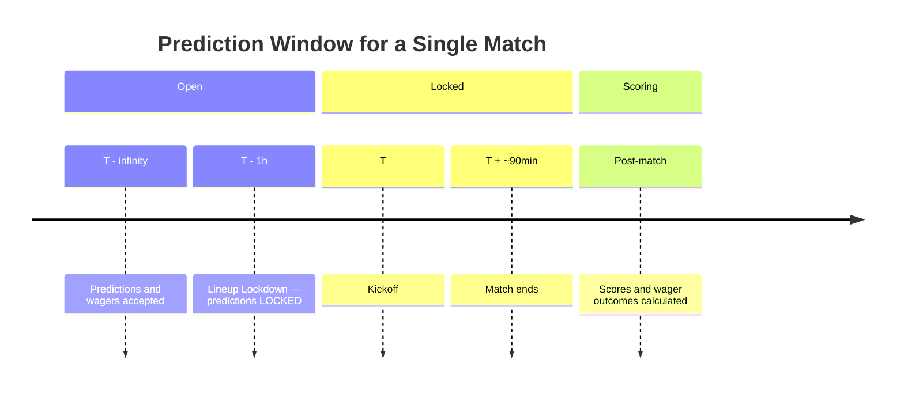

- **Lock threshold:** 60 minutes (`LOCK_LEAD_MINUTES`) before each match's `kickoff_time`.
- **`is_locked(match)`** is evaluated at request time using current SGT time — no DB column stores the locked state.
- After locking, any attempt to call `upsert_prediction()` or `set_wagers()` raises `PredictionError` with a user-friendly message.
- Users can still **view** their locked predictions via `/status`.

---

## 10. User & Group Flows

### Group Setup & Registration

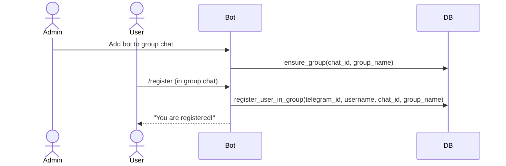

### Daily Prediction Flow (private DM)

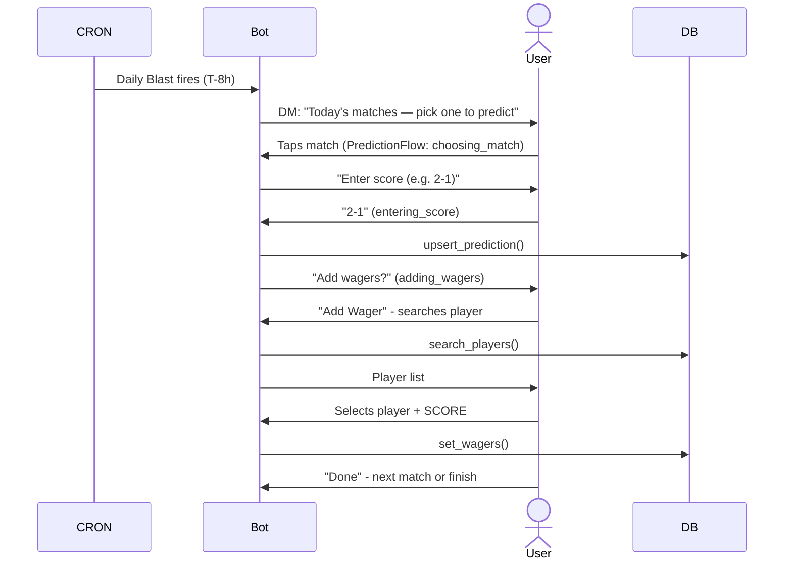

### Post-Match & Daily Reveal

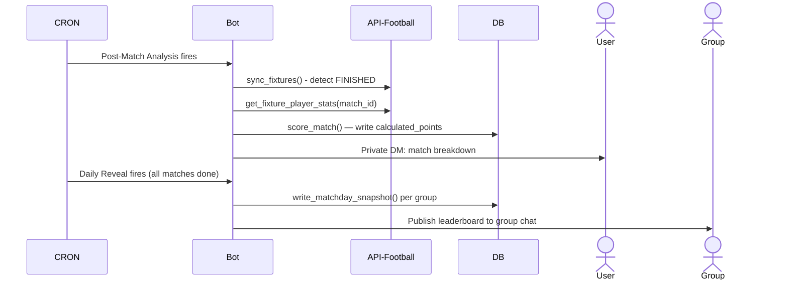

### Intermediate Joiner Rules

| Scenario | Behaviour |
|---|---|
| User joins a group mid-tournament and has played before | All historical predictions count toward the new group immediately |
| User joins a group mid-tournament and is brand new | Can only make predictions from 8 hours before the next gameday after joining; those predictions count for this group (and any future groups) |

---

## 11. Data Flow — End-to-End

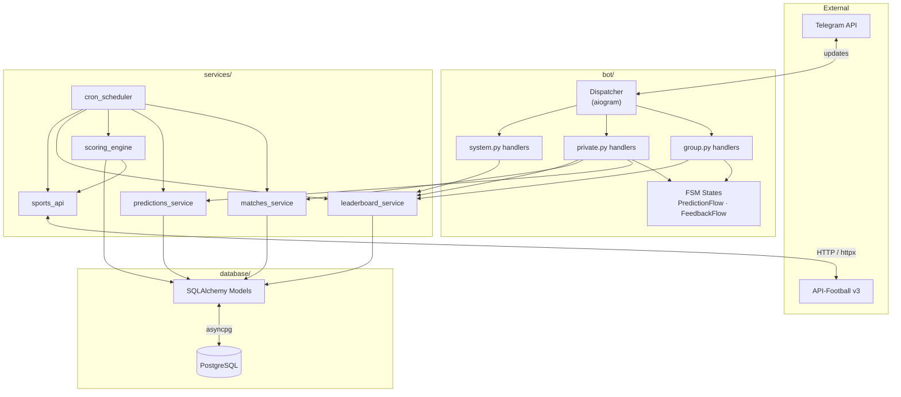

---

## 12. Scripts

### `scripts/backfill_player_ids.py`

A one-time offline maintenance script that resolves the `world_cup_players.player_id` column — the canonical API-Football player id — for every row in the player pool.

**Why it exists:** `world_cup_players.api_player_id` comes from a different id namespace than the one used by `/fixtures/players`. Without backfilling, wager scoring must fall back to fuzzy name matching. With it, `score_match()` can join by id (exact and drift-immune).

**Resolution tiers (strongest first):**

| Tier | Method |
|---|---|
| `manual` | `MANUAL_OVERRIDES` dict — verified by hand for edge cases |
| `exact` | Normalised full name is identical |
| `initial` | Unique first-initial + surname key match |
| `surname` | Unique normalised surname, same first initial |
| `fuzzy` | Token-sorted `SequenceMatcher` ≥ 0.84 similarity, must beat runner-up by ≥ 0.08 |

The `TeamIndex` class encapsulates all per-team resolution logic — built once per team squad from `/players/squads` API data and reused for all players on that team.

**Usage:**

```bash
python -m scripts.backfill_player_ids            # apply changes
python -m scripts.backfill_player_ids --dry-run  # report only, write nothing
```

Unresolved players remain `NULL` and continue to score via the name-matching fallback — this is never a regression.

---

## 13. Deployment

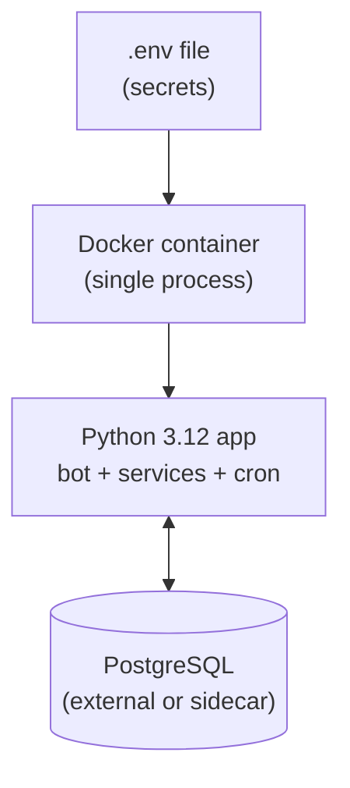

- **Single Docker container** — no sidecar workers, no orchestration.
- **Single PostgreSQL database** — all tables in one schema.
- **All cron jobs run inside the application process** via APScheduler — no external scheduler, no Celery, no cron daemon.
- **All secrets via environment variables** — no secrets in code or image layers.
- **Schema applied out-of-band** — `database/schema.sql` is run once manually (or as a Docker entrypoint step) before the app starts. The ORM does not auto-create tables.

---

## 14. Error Handling

| Error category | Behaviour |
|---|---|
| **Expected business errors** (`PredictionError`, lock violations, invalid input) | Caught in handlers; user receives a friendly Telegram message |
| **Unexpected errors** (DB failures, API timeouts, unhandled exceptions) | Logged with full traceback; user receives a generic error message |
| **Stack traces** | Never exposed to users |
| **Cron job failures** | Logged; job retries on the next scheduled tick (all jobs are idempotent) |
| **API-Football errors on HTTP 200** | `SportsApiError` raised if the `errors` field is non-empty in the response |
| **Failed player stat fetch** | Wagers remain `PENDING` and are retried on the next scoring tick, rather than being incorrectly voided |

---

## 15. Key Design Constraints

These constraints are final and enforced by project convention (see `CLAUDE.md`):

| Constraint | Rationale |
|---|---|
| **Monolith only** | Single developer; simplicity over scale |
| **No Redis, Celery, RabbitMQ, Kafka** | Minimise infrastructure complexity |
| **No leaderboard caching** | Avoid stale data bugs; queries are fast enough |
| **No premature abstractions** | Only abstract when a pattern is used ≥ 2 times |
| **No generic repositories** | Direct SQLAlchemy queries in service functions |
| **Handlers never touch DB or APIs** | Clean separation; handlers are thin glue |
| **All jobs must be idempotent** | Safety against double-runs and restarts |
| **Sports API is authoritative** | Only `FINISHED` matches from the API are scored |
| **Predictions are user-owned, not group-owned** | A prediction submitted once counts for all groups the user is in |
| **Timezone: Asia/Singapore (SGT)** | All date calculations use SGT; `settings.tzinfo` is the single source |
